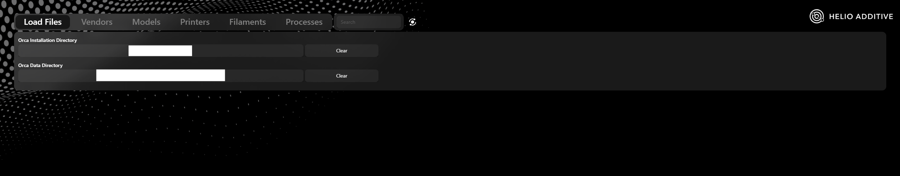
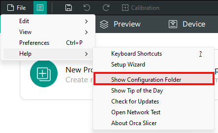
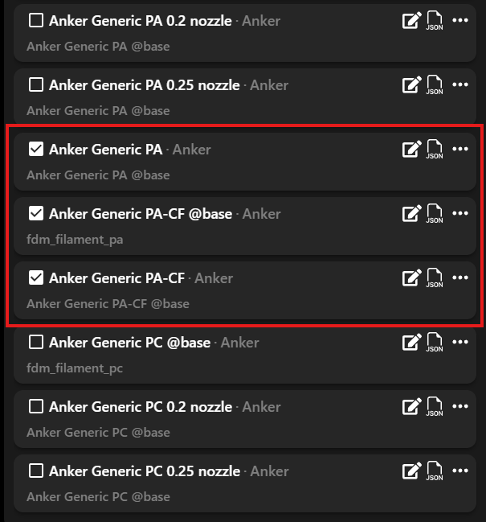
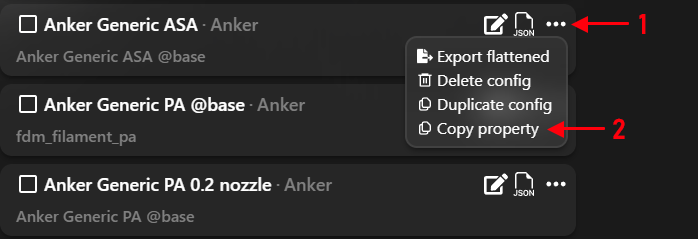
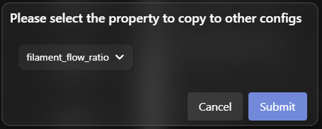
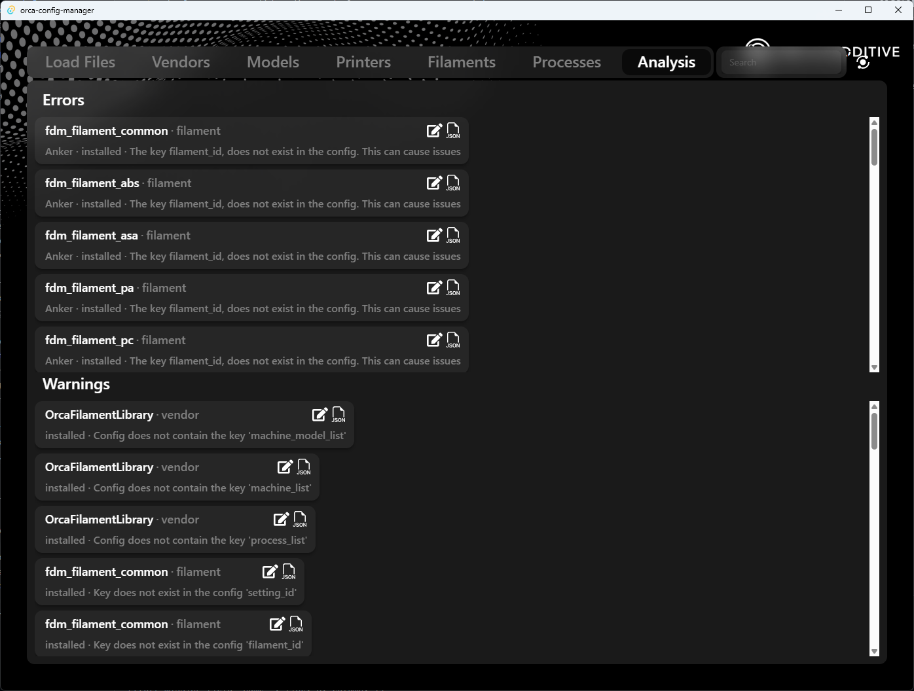

# Understanding OrcaSlicer Config System

### The doc is written for OrcaSlicer but about 90% of it is applicable as it is to BambuStudio and PrusaSlicer

- ### [How to Build](docs/how-to-build.md)

- ### [Config Types](docs/config-types.md)

- ### [Installed, loaded and user configs](docs/config-locations.md)

# How to load configurations into the configuration manager

When you first open the config manager you will be greeted with this screen.

[**Orca Installation Directory**](docs/config-locations.md#installed): this is the path where OrcaSlicer is installed. For windows it is the path in `Program Files`. For Mac OS, it is the Application Package.

#### Defaults

**Windows**: C:/Program Files/OrcaSlicer  
**MacOS**: /AppData/Roaming/OrcaSlicer.app  
**Linux**: Those nerds can figure it out themselves

These defaults will be loaded automatically when you open the app. If the installation folder has been changed, you will have to manually set it.

[**Orca Data Directory**](docs/config-locations.md#loaded): This is the path where OrcaSlicer stores configuration data. You can open it by launching orca slicer and finding this option:

The default for this will also be automatically loaded on launch. You only need to set it if a non default folder has been set for configurations.

# Config Operations

##  Edit config: Opens the config in a window where you can see and edit any properties.

### See [Edit Config Window](docs/edit-config-window.md) for more

##  Open containing folder: Opens the folder containing the config JSON file.

##  Export flattened: Exports the config in a flattened form i.e. removes all inheritance and puts everything in one config that can be imported in OrcaSlicer without fail.

##  Delete config: Deletes the configuration. Also alters the vendor config if it is in the installed section.

##  Duplicate config: You can duplicate the config into the same vendor or a different vendor.

# Copying a property from one config to another

If you want to copy a property from one config to another 
**Step 1**: Check select all the configs you want too copy the property to 
 
**Step 2**: Go to the config you want to copy the config from. Click the three dots menu and click `Copy property` 
 
**Step 3**: Select the property to copy and click `Submit` 
 

## NOTE: You can use this button:  on top right to clear the selection

# Analysing configs

You can run an analysis on configs to highlight any errors and show them in the analysis tab. Just click the `Analyse configs` icon:  on top right of your window.

It will then run an analysis in the background and show all errors and warnings in the analysis tab.

# Deleting multiple configs

Similar to [copying property](#copying-a-property-from-one-config-to-another), you can select the configs and then just click the `Delete` button: 
