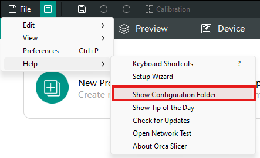

# Config Locations

### There are 3 places where configs are stored in OrcaSlicer

### Installed

This is the installation folder. For Windows, it's in Program Files. For mac it is in the Application package. It resides inside `resources/profiles` directory. It contains a configuration file for every Vendor and a directory corresponding to it. Each of the directories includes a configuration bundle

### Loaded

These are just the same installed configs but the ones that you select in the prineter/filament wizard are copied over into the data directory in the `system` subdirectory. If you want to open your data directory, you can open OrcaSlicer and find this option

### User

These are the configurations created by the users. It resides inside the `user` directory in the data directory.
