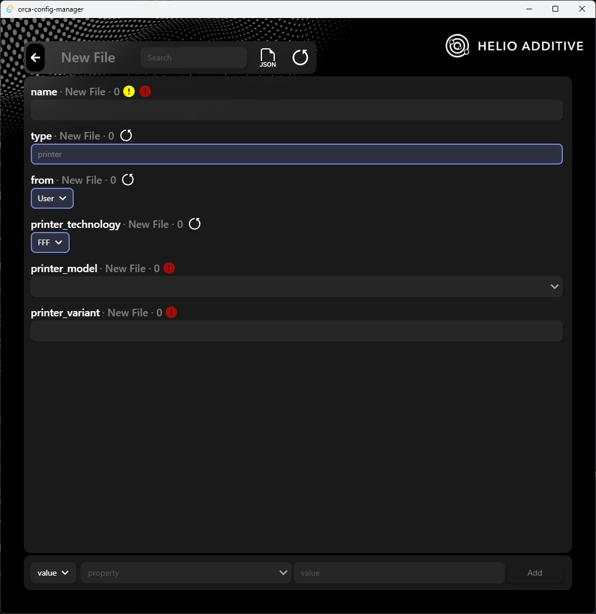

# Create New Config

The create new window is the same as the [Edit Config window](./edit-config-window.md) 

The create new config window will show you. The fields work exactly the same as the fields on duplicate config or edit config.

## Notes

- It will show some critical errors and not allow you to save a config that is critically broken.
- A config will only show up in Orca Slicer UI if `instantiation` is set to true.
- A config will only show up in Orca Slicer UI if `setting_id` is set to a unique value starting with `GM`. The analysis tab will warn you if missing IDs and wrong patterns and also of duplicate IDs.
