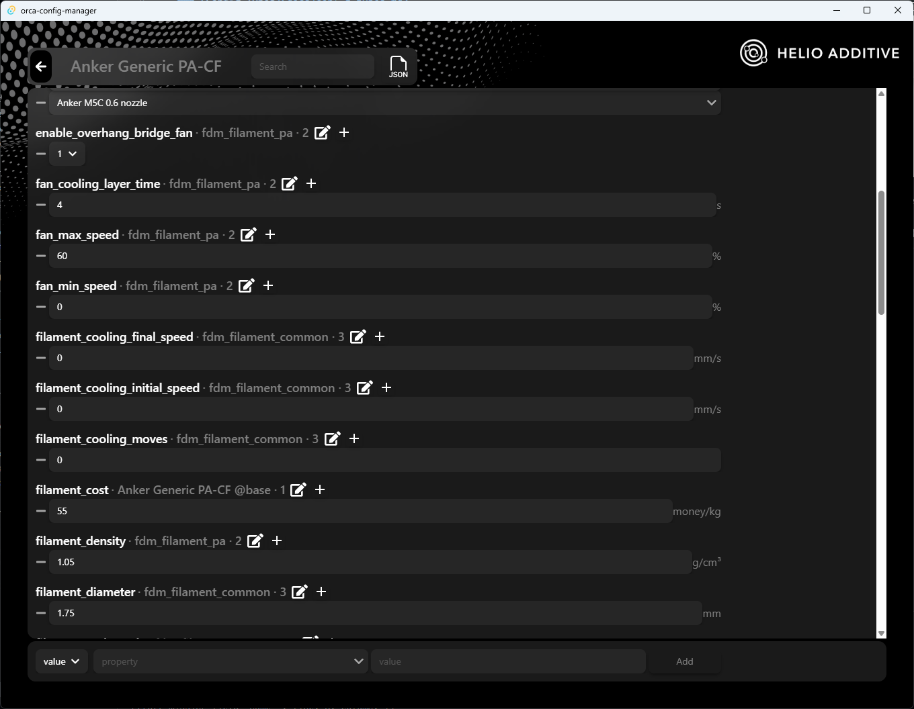
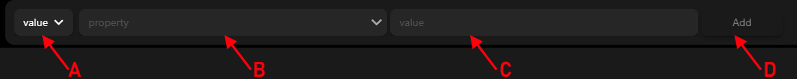

# Edit Config Window

This window shows all the properties of this config and also all the properties it inherits.

There is the property name and  
**A**: Current value of the property  
**B**: The config this property is inherited from. It says `base` if the property is defined in this config 
**C**: The level of inheritance. `0` for `base` and then increases its way up the inheritance tree.
**D**: Edit the config this property is inherited from
**E**: Only appears for properties with array values and adds another value to the array

When you change a property it becomes highlighted 
 
It will show you this reset button to reset this property to the previous value.

### Top Buttons

 
The top of the edit config window shows a few buttons. These are `Open containing folder`, `Save changes` and `Reset all` respectively. These are self explanatory.

### New Property

 
You can use this part at the bottom of the page to create a new property 
**A**: Select whether the new property is a single `value` or `array` 
**B**: Name for the new property. When you start entering a name, it will show you a list of all properties the manager recognizes.  
**C**: The value for this property. As you start to fill it, it will show you some possible values if it can find them.
**D**: Add button, adds it to the config
